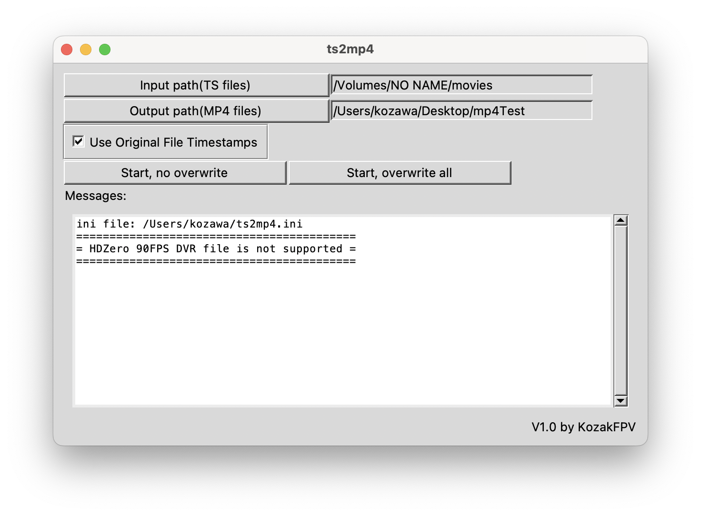

# ts2mp4
This program converts HDZero DVR files in TS video format to MP4 files.
- No re-encoding, thus faster
- Keep original file timestamp (optional)
- One-click processing for multiple files

日本語での解説は私のブログを参照願います。
https://www.nkozawa.com/blog/archives/7677

## HDZero
https://www.hd-zero.com/
This is digital video system for FPV drones.

## Setup
- Install FFmpeg  
https://ffmpeg.org/download.html
 Open terminal window and enter 'ffmpeg'. If 'ffmpeg' does not run, please setup PATH enviroment variable correctlly.
- If you have Python3, just run ts2mp4.py. I tested this script under Python 3.11.8. ts2mp4 may not work on older version of Python3.
- MacOS and Windows executables are also available.

## Usage

1. Click "Input path(TS files)" to specify TS files locatioon. This could be 'movies' folder of HDZero SD card.
2. Click "Output path(MP4 files)" to specify folder path to place MP4 files.
3. Check "Use Original File Timestamnps", if you want to copy file timestmaps (atime and mtime) from TS file to MP4 file. You need to install RTC battery to HDZero goggle to make TS files timestamp correctlly. If you want to have current timestamps on MP files. please un-check this.
4. Click "Start, no overwrite" or "Star, overwrite all" to start process.

## INI file
"ts2mp4.ini" file will be created on your home folder when start conversion process.
